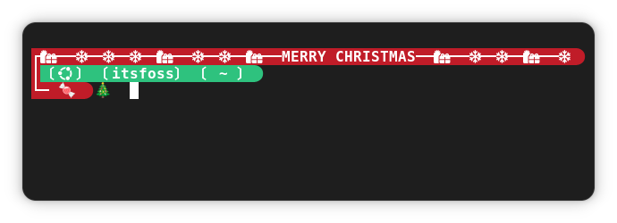

Here you can find config files for the starship prompt.

To enable, first download the required config file.

Then copy the file to the ~/.config file as starship.toml.

For example, if you are using the nord_segments.toml config file, download it to the ~/Downloads directory.

Now, use the command:

```
cp ~/Downloads/nord_segments.toml ~/.config/starship.toml
```
Change the path accordingly.

## Here are the config file and screenshots.

[Nord Segments config](./nord_segments.toml)


[Fiery config](./fiery.toml)


[Connected Dots config](./connected_dots.toml)


[XmasPrompt Config](./xmasprompt.toml)



## Installer Script

You can use the following command to install the theme.

```
bash -c "$(curl -sSL https://raw.githubusercontent.com/itsfoss/public-dot-files/main/starship/installer.sh)"
```
